# btc_line

[](https://crates.io/crates/btc_line)
[](https://docs.rs/btc_line)

<br>
[](https://github.com/valeratrades/btc_line/actions?query=branch%3Amaster) <!--NB: Won't find it if repo is private-->
[](https://github.com/valeratrades/btc_line/actions?query=branch%3Amaster) <!--NB: Won't find it if repo is private-->




```mermaid
graph TD
    base.cv::user["**User**<br>[External]"]
    base.cv::crypto_exchanges["**Cryptocurrency Exchanges**<br>/home/v/s/btc_line/Cargo.toml `v_exchanges = { version = #quot;=0.17.0#quot; }`, /home/v/s/btc_line/src/main.rs `use v_exchanges::{Exchange, binance::Binance};`, /home/v/s/btc_line/src/main_line.rs `use v_exchanges::{Binance, Exchange as _, ExchangeResult, ExchangeStream, Instrument, Trade, adapters::generics::ws::WsError};`"]
    subgraph base.cv::btc_line_app_boundary["**btc_line Application**<br>[External]"]
        base.cv::main_line_processor["**Main Line Processor**<br>/home/v/s/btc_line/src/main_line.rs `pub struct MainLine`, /home/v/s/btc_line/src/main_line.rs `fn create_ws_connection`, /home/v/s/btc_line/src/main_line.rs `fn handle_lsr`"]
        base.cv::additional_line_processor["**Additional Line Processor**<br>/home/v/s/btc_line/src/additional_line.rs `pub struct AdditionalLine`, /home/v/s/btc_line/src/additional_line.rs `fn get_open_interest_change`, /home/v/s/btc_line/src/additional_line.rs `fn get_btc_volume_change`"]
        base.cv::output_formatter["**Output Formatter**<br>/home/v/s/btc_line/src/output.rs `pub struct Output`, /home/v/s/btc_line/src/output.rs `fn output`"]
        %% Edges at this level (grouped by source)
        base.cv::main_line_processor["**Main Line Processor**<br>/home/v/s/btc_line/src/main_line.rs `pub struct MainLine`, /home/v/s/btc_line/src/main_line.rs `fn create_ws_connection`, /home/v/s/btc_line/src/main_line.rs `fn handle_lsr`"] -->|"Sends formatted data to"| base.cv::output_formatter["**Output Formatter**<br>/home/v/s/btc_line/src/output.rs `pub struct Output`, /home/v/s/btc_line/src/output.rs `fn output`"]
        base.cv::additional_line_processor["**Additional Line Processor**<br>/home/v/s/btc_line/src/additional_line.rs `pub struct AdditionalLine`, /home/v/s/btc_line/src/additional_line.rs `fn get_open_interest_change`, /home/v/s/btc_line/src/additional_line.rs `fn get_btc_volume_change`"] -->|"Sends formatted data to"| base.cv::output_formatter["**Output Formatter**<br>/home/v/s/btc_line/src/output.rs `pub struct Output`, /home/v/s/btc_line/src/output.rs `fn output`"]
    end
    %% Edges at this level (grouped by source)
    base.cv::main_line_processor["**Main Line Processor**<br>/home/v/s/btc_line/src/main_line.rs `pub struct MainLine`, /home/v/s/btc_line/src/main_line.rs `fn create_ws_connection`, /home/v/s/btc_line/src/main_line.rs `fn handle_lsr`"] -->|"Pulls Trade Data"| base.cv::crypto_exchanges["**Cryptocurrency Exchanges**<br>/home/v/s/btc_line/Cargo.toml `v_exchanges = { version = #quot;=0.17.0#quot; }`, /home/v/s/btc_line/src/main.rs `use v_exchanges::{Exchange, binance::Binance};`, /home/v/s/btc_line/src/main_line.rs `use v_exchanges::{Binance, Exchange as _, ExchangeResult, ExchangeStream, Instrument, Trade, adapters::generics::ws::WsError};`"]
    base.cv::main_line_processor["**Main Line Processor**<br>/home/v/s/btc_line/src/main_line.rs `pub struct MainLine`, /home/v/s/btc_line/src/main_line.rs `fn create_ws_connection`, /home/v/s/btc_line/src/main_line.rs `fn handle_lsr`"] -->|"Pulls LSR Data"| base.cv::crypto_exchanges["**Cryptocurrency Exchanges**<br>/home/v/s/btc_line/Cargo.toml `v_exchanges = { version = #quot;=0.17.0#quot; }`, /home/v/s/btc_line/src/main.rs `use v_exchanges::{Exchange, binance::Binance};`, /home/v/s/btc_line/src/main_line.rs `use v_exchanges::{Binance, Exchange as _, ExchangeResult, ExchangeStream, Instrument, Trade, adapters::generics::ws::WsError};`"]
    base.cv::additional_line_processor["**Additional Line Processor**<br>/home/v/s/btc_line/src/additional_line.rs `pub struct AdditionalLine`, /home/v/s/btc_line/src/additional_line.rs `fn get_open_interest_change`, /home/v/s/btc_line/src/additional_line.rs `fn get_btc_volume_change`"] -->|"Pulls OI and Volume Data"| base.cv::crypto_exchanges["**Cryptocurrency Exchanges**<br>/home/v/s/btc_line/Cargo.toml `v_exchanges = { version = #quot;=0.17.0#quot; }`, /home/v/s/btc_line/src/main.rs `use v_exchanges::{Exchange, binance::Binance};`, /home/v/s/btc_line/src/main_line.rs `use v_exchanges::{Binance, Exchange as _, ExchangeResult, ExchangeStream, Instrument, Trade, adapters::generics::ws::WsError};`"]
    base.cv::user["**User**<br>[External]"] -->|"Receives data from"| base.cv::output_formatter["**Output Formatter**<br>/home/v/s/btc_line/src/output.rs `pub struct Output`, /home/v/s/btc_line/src/output.rs `fn output`"]
```

## Usage
```sh
btc_line start
```


<br>

<sup>
	This repository follows <a href="https://github.com/valeratrades/.github/tree/master/best_practices">my best practices</a> and <a href="https://github.com/tigerbeetle/tigerbeetle/blob/main/docs/TIGER_STYLE.md">Tiger Style</a> (except "proper capitalization for acronyms": (VsrState, not VSRState) and formatting). For project's architecture, see <a href="./docs/ARCHITECTURE.md">ARCHITECTURE.md</a>.
</sup>

#### License

<sup>
	Licensed under <a href="LICENSE">Blue Oak 1.0.0</a>
</sup>

<br>

<sub>
	Unless you explicitly state otherwise, any contribution intentionally submitted
for inclusion in this crate by you, as defined in the Apache-2.0 license, shall
be licensed as above, without any additional terms or conditions.
</sub>

